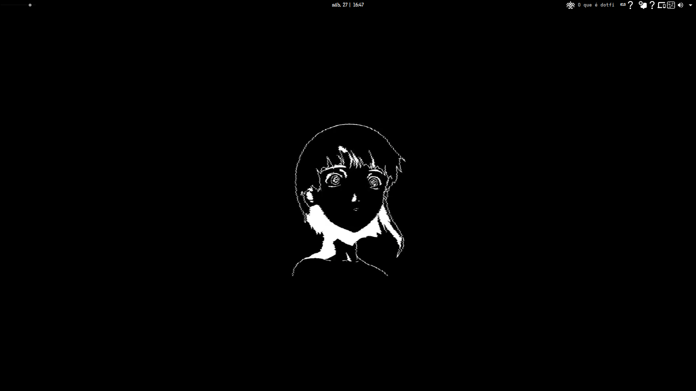
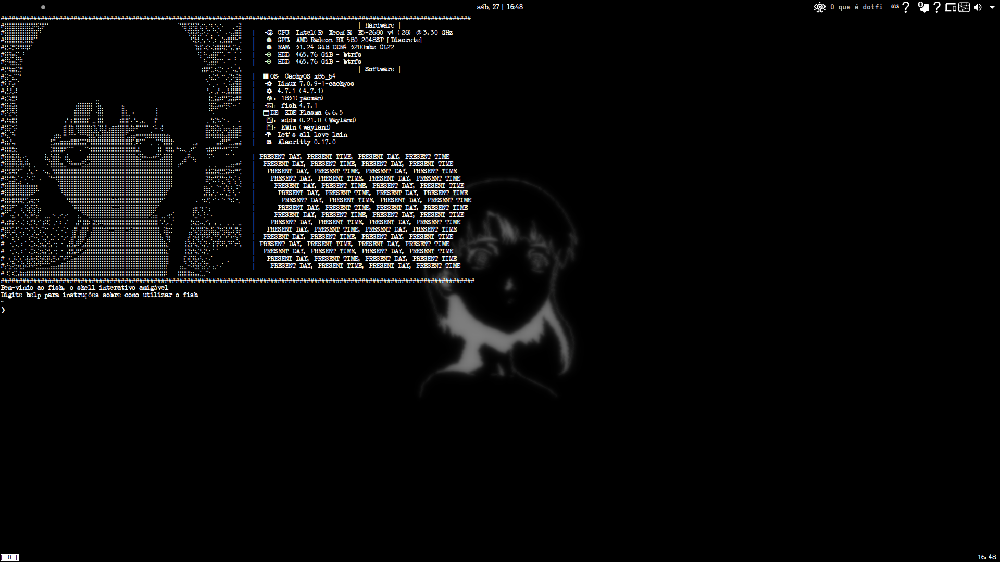
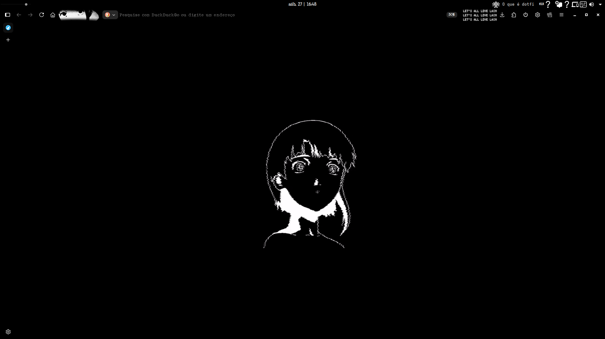

# 🌐 Lain-Dotfiles-Linux-KDEPlasma-

> *"Present day, present time. Hahaha..."*

A minimalist and customized KDE Plasma environment inspired by the aesthetics of **Serial Experiments Lain**. Configured on top of CachyOS using Fish Shell and Alacritty.

---

## 📸 Screenshots

Here is how the setup looks in action:

### Desktop Environment


### Terminal & Shell


### Browser


---

## 🛠️ What's Included?
* **DE:** KDE Plasma (Shortcuts, KWin rules, Globals)
* **Shell:** Fish Shell (with custom functions included)
* **Terminal:** Alacritty (Fonts and color scheme configurations)
* **Multiplexers:** Tmux configuration
* **Extras:** Wallpapers (Lain-themed Images, GIFs, and Videos) & Typewriter Fonts

---

## 🚀 Automatic Installation

To automatically apply all configurations, symbolic links, fonts, and wallpapers directly onto your system, simply run the included installation script:

```bash
# 1. Give execution permission to the script
chmod +x scripts/install.sh

# 2. Run the installer
./scripts/install.sh
